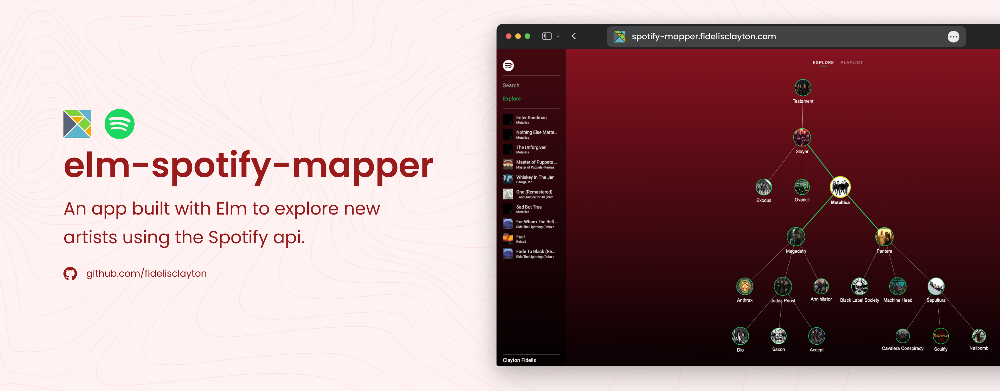
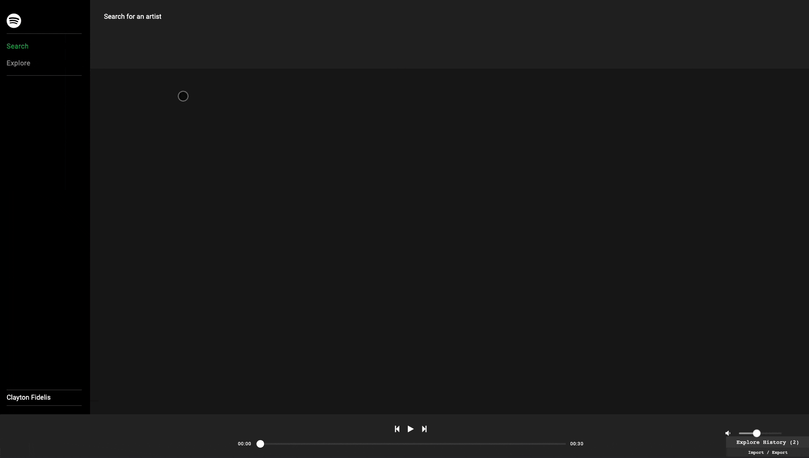
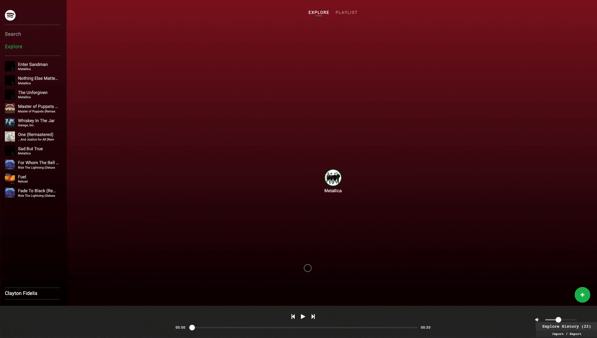
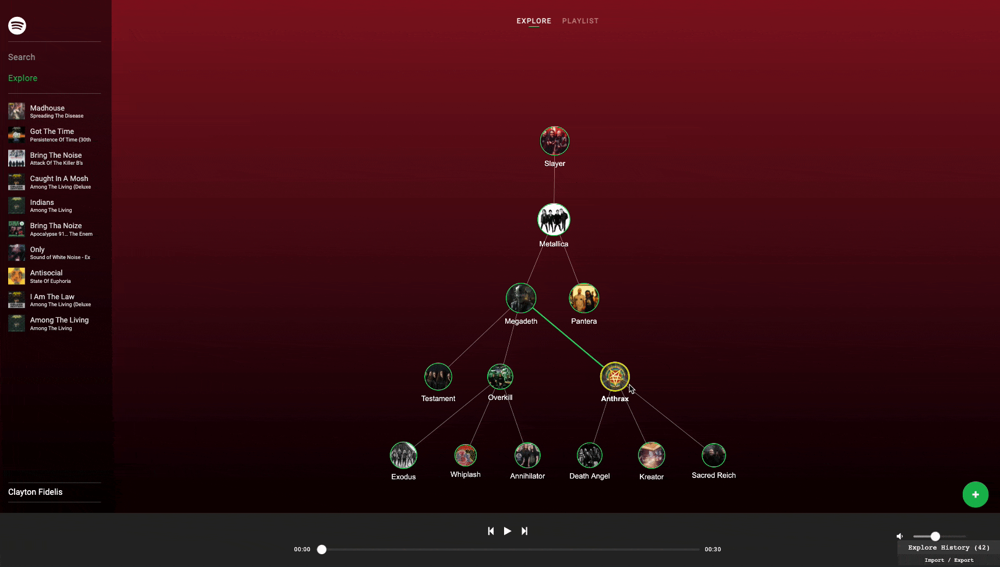
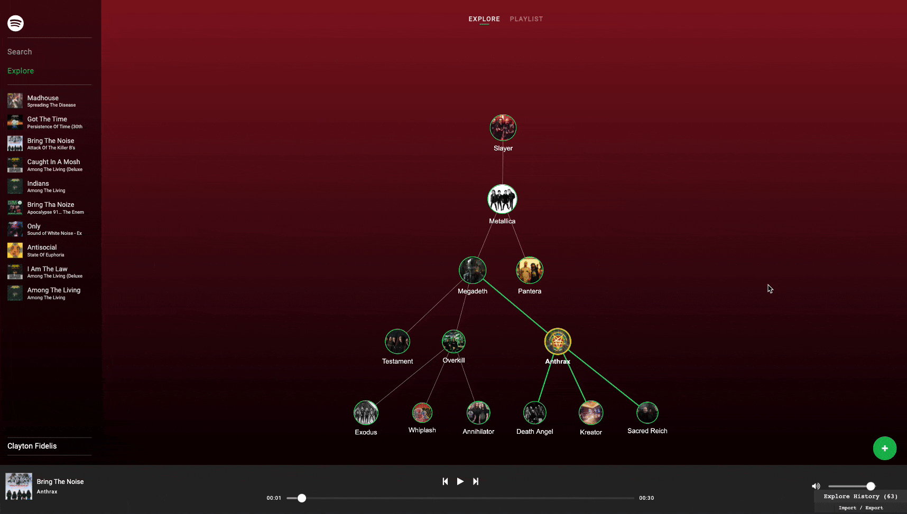

# Spotify Mapper



This app is a new version of my previous Spotify mapper built with Angular 1.x. I used this app to learn more about Elm and see how it works beyond the simplicity of to-do apps.

## :package: Features

### :mag_right: Search for artists or bands

Your journey starts by searching for any artist available on Spotify.


### :microphone: Explore similar artists

Then you can explore similar artists by clicking on the artist image.


### :notes: Preview songs

You can listen to a preview of the artist top 5 songs.


### :musical_score: Save the playlist

Finally, you can also save the playlist so you can listen directly on your Spotify app.


## Installation

```sh
$ git clone https://github.com/FidelisClayton/elm-spotify-mapper
$ cd elm-spotify-mapper
$ npm install
```

After clone this repository run `npm install` inside the project folder to install and build the project dependencies.

## :runner: Getting started

First of all you will need to set the environment variables with your spotify developer credentials:

```sh
cp .env.sample .env
```

Open the `.env` file and set the `CLIENT_ID`, `CLIENT_SECRET` and `REDIRECT_URI`.
To run this project in your machine you just need to execute the `npm start`command, it will start a development server on port `3000`. Enjoy it!

## :heart: Contributing

Please use the [issue tracker](https://github.com/FidelisClayton/elm-spotify-mapper/issues) to report bugs or suggest new features and feel free to fix bugs or add new features on the project. Your contributions is always welcome!
